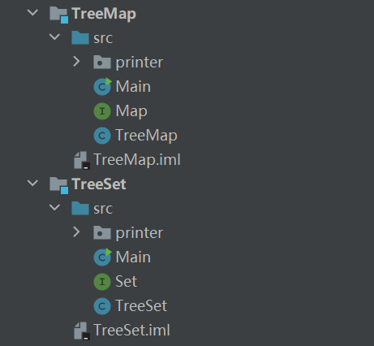

# 数据结构：集合（Set）与映射（Map）代码实现

> 山东大学（威海）数学与统计学院
>
> 2018级 数据科学与人工智能实验班 孙易泽

本项目基于**二叉搜索树**，实现了TreeSet与TreeMap数据结构，实现时分别使用了java与python语言。以下内容为项目的简短说明：

## java实现

### 1. 文件结构

+ Main文件：测试文件
+ Map/Set文件：定义接口
+ TreeMap/TreeSet：数据结构主要文件



### 2. 接口定义

+ TreeSet接口

```java
public interface Set<E> {
    int size();
    boolean isEmpty();
    void clear();
    void add(E element);
    void remove(E element);
    boolean contains(E element);
    /** 遍历所有元素（按照元素从小到大的顺序遍历） */
    void traversal(Visitor<E> visitor);
    /** Visitor结构 */
    public static abstract class Visitor<E> {
        boolean stop;
        public abstract boolean visit(E element);
    }
}
```

+ TreeMap接口

```java
public interface Map<K, V> {
    int size();
    boolean isEmpty();
    void clear();
    V put(K key, V value);
    V get(K key);
    V remove(K key);
    boolean containsKey(K key);
    boolean containsValue(V value);
    void traversal(Visitor<K, V> visitor);

    public static abstract class Visitor<K, V> {
        boolean stop;
        public abstract boolean visit(K key, V value);
    }
}

```

## python实现

### 1. 文件结构

+ TreeMap.py和TreeSet.py分别为对应数据结构的python实现

### 2. Node定义

```python
class Node(object):
    def __init__(self, element, parent=None, right=None, left=None):
        self.element = element
        self.right = right
        self.left = left
        self.parent = parent

   def degree(self):
        ret = 0
        if self.left is not None:
        	ret += 1
        if self.right is not None:
            ret += 1
        return ret
```

### 3. Visitor结构

```python
class Visitor:
    def __init__(self):
        self.stop = False
	
    def visit(self, key, value):
        if key == 'a':
        return True
        print(str(key)+':'+str(value))
        return False
```
